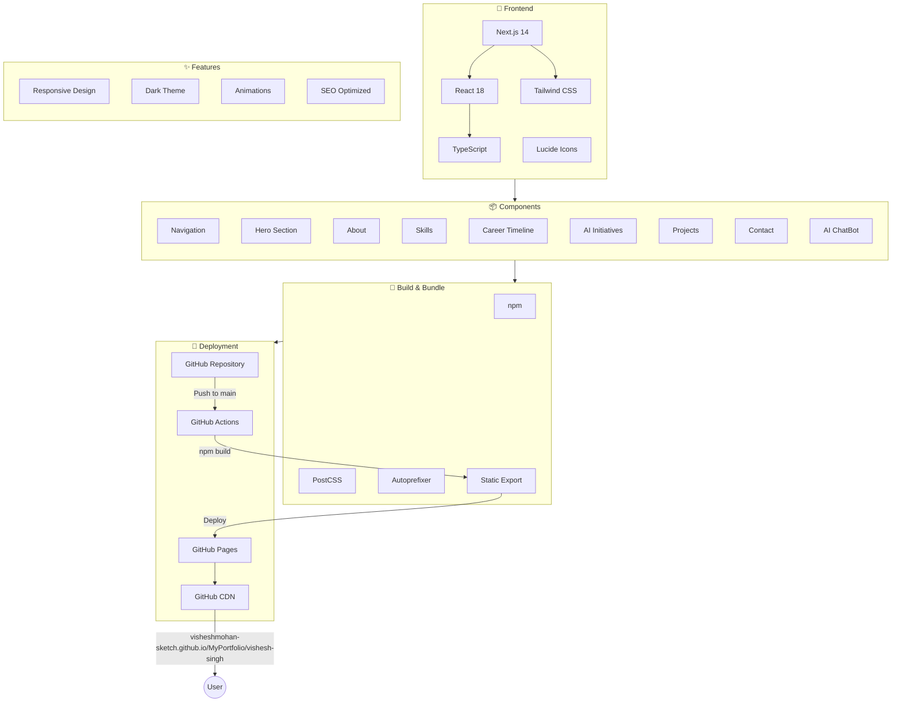
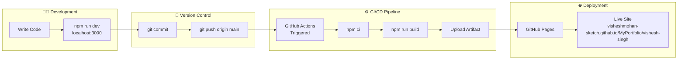

# Portfolio Architecture

🌐 **Live Site**: [https://visheshmohan-sketch.github.io/MyPortfolio/vishesh-singh/](https://visheshmohan-sketch.github.io/MyPortfolio/vishesh-singh/)

## System Architecture



## Deployment Pipeline



## Tech Stack (This Project)

| Layer | Technology | Purpose |
|-------|------------|---------|
| **Frontend Framework** | Next.js 14 | React framework with static export |
| **UI Library** | React 18 | Component-based UI |
| **Language** | TypeScript | Type safety |
| **Styling** | Tailwind CSS | Utility-first CSS |
| **Icons** | Lucide React | Icon library |
| **Build Tools** | PostCSS, Autoprefixer | CSS processing |
| **Version Control** | Git + GitHub | Source code management |
| **CI/CD** | GitHub Actions | Automated build & deploy |
| **Hosting** | GitHub Pages | Free static hosting + CDN |
| **Domain** | github.io | Free subdomain |

---

## 💡 Full Technology Expertise

### ☁️ Cloud & Infrastructure
| Technology | Experience Level | Context |
|------------|-----------------|---------|
| **Azure** | Expert | Production SaaS platforms |
| **Kubernetes (AKS)** | Expert | Container orchestration at scale |
| **Microservices** | Expert | Distributed system architecture |
| **Docker** | Advanced | Containerization |

### 💻 Development & Languages
| Technology | Experience Level | Context |
|------------|-----------------|---------|
| **Java** | Expert | Enterprise backend development |
| **SQL** | Expert | Database design & optimization |
| **React** | Advanced | Modern frontend development |
| **TypeScript** | Advanced | Type-safe JavaScript |
| **REST APIs** | Expert | Service integration |
| **Spark** | Advanced | Big data processing pipelines |

### 🔧 DevOps & Automation
| Technology | Experience Level | Context |
|------------|-----------------|---------|
| **CI/CD Pipelines** | Expert | Build & deployment automation |
| **Rundeck** | Advanced | Self-service deployments |
| **Cypress** | Advanced | End-to-end test automation |
| **Test Automation** | Expert | Quality engineering |
| **Performance Optimization** | Expert | System tuning |

### 🤖 AI & Machine Learning
| Technology | Experience Level | Context |
|------------|-----------------|---------|
| **LLMs (GPT, Claude)** | Advanced | AI integration in workflows |
| **AI Agents** | Advanced | Automated task execution |
| **GitHub Copilot** | Advanced | AI-assisted development |
| **Prompt Engineering** | Advanced | Effective AI utilization |

### 📊 Program & Project Management
| Technology | Experience Level | Context |
|------------|-----------------|---------|
| **JIRA** | Expert | Portfolio & project tracking |
| **Agile/Scrum** | Expert | Team delivery methodology |
| **SAFe** | Advanced | Scaled agile framework |
| **Kanban** | Advanced | Workflow management |

### 🎯 Leadership & Soft Skills
| Skill | Demonstrated Impact |
|-------|---------------------|
| **Team Building** | 90% retention rate |
| **Mentorship** | Multiple promotions facilitated |
| **Stakeholder Communication** | Executive dashboards, cross-team alignment |
| **Risk Management** | Proactive issue identification |
| **Strategic Planning** | Roadmap & initiative ownership |

### 🔒 Security & Compliance
| Technology | Experience Level | Context |
|------------|-----------------|---------|
| **Ethical Hacking** | Intermediate | AppScan, Paros (Fiserv era) |
| **ACH/NACHA** | Advanced | Payment compliance |

---

## Component Structure

```
src/
├── app/
│   ├── globals.css      # Global styles + Tailwind
│   ├── layout.tsx       # Root layout + SEO metadata
│   └── page.tsx         # Main page composition
└── components/
    ├── Navigation.tsx   # Responsive navbar with mobile menu
    ├── Hero.tsx         # Hero section with profile
    ├── About.tsx        # Summary + leadership philosophy
    ├── Skills.tsx       # Skills grid by category
    ├── Timeline.tsx     # Interactive career timeline
    ├── AIInitiatives.tsx # AI projects showcase
    ├── Projects.tsx     # Key achievements with metrics
    ├── Contact.tsx      # Contact information
    └── ChatBot.tsx      # AI-powered Q&A widget
```

## Key Features

### 🤖 AI ChatBot
- Pattern-matching based Q&A about experience
- Knowledge base with career, skills, and achievements
- Floating widget with typing animation

### 📱 Responsive Design
- Mobile-first approach
- Collapsible navigation
- Adaptive layouts for all screen sizes

### ⚡ Performance
- Static site generation (SSG)
- Optimized assets via Next.js
- CDN delivery via GitHub Pages

### 🎨 Design
- Dark theme with gradient accents
- Smooth animations and transitions
- Card hover effects

## Infrastructure Cost

| Service | Cost |
|---------|------|
| GitHub Repository | Free |
| GitHub Actions | Free (2,000 mins/month) |
| GitHub Pages | Free |
| Custom Domain | Optional (~$12/year) |
| **Total** | **$0/month** |

## Future Enhancements

- [ ] OpenAI/Claude API integration for smarter chatbot
- [ ] Blog section with MDX
- [ ] Project detail pages
- [ ] Analytics integration
- [ ] Custom domain setup
